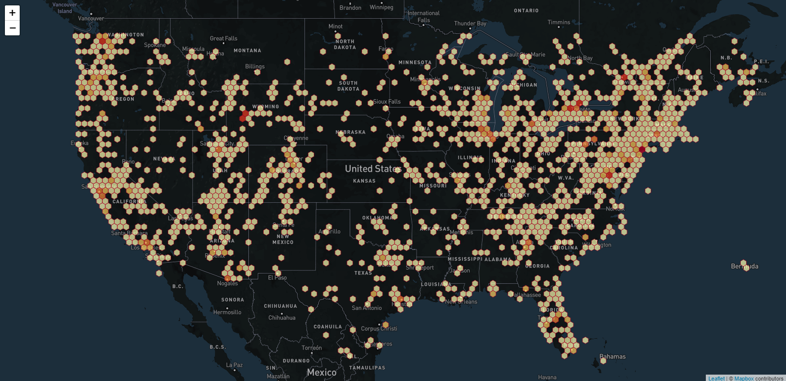
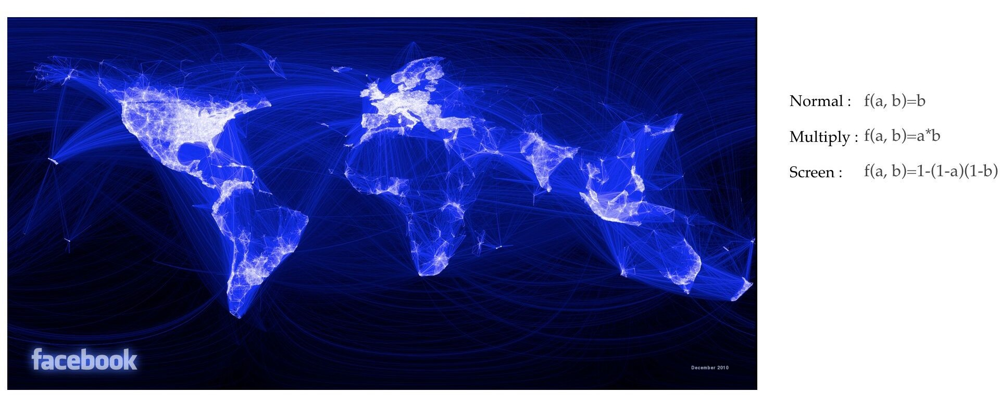
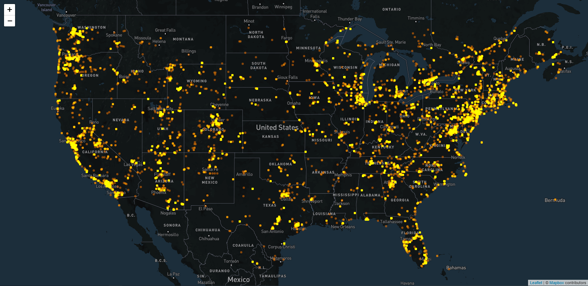
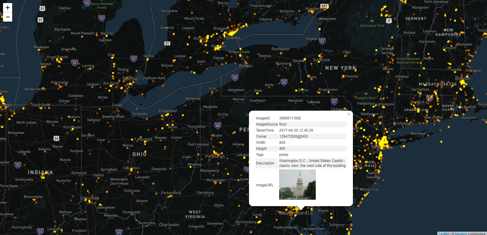
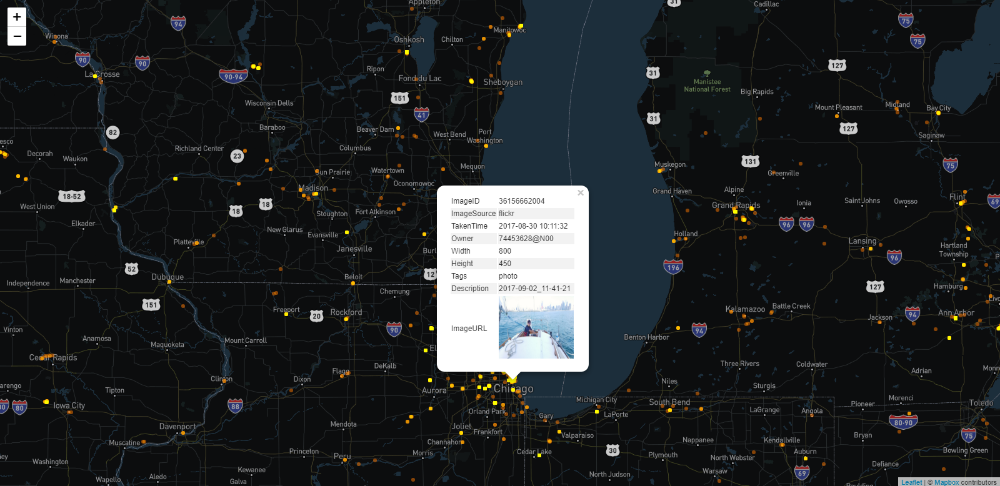
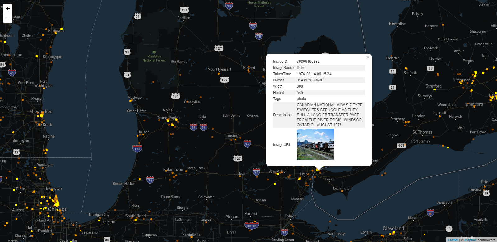
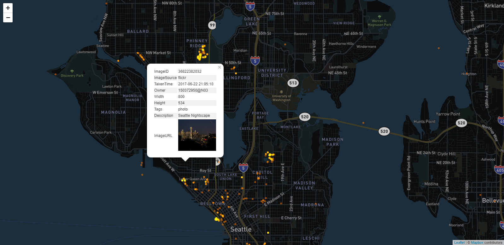
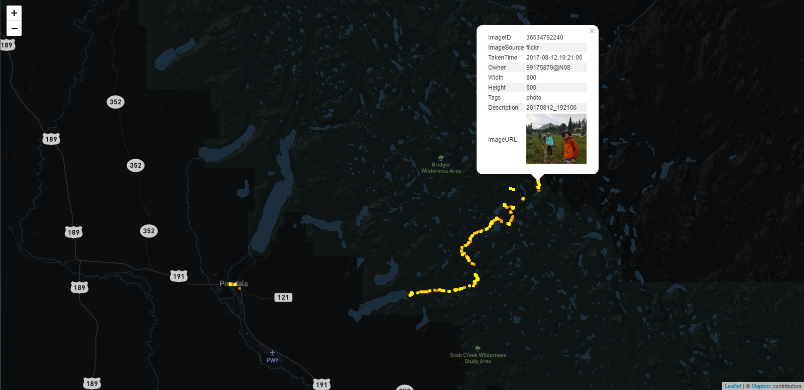

## Geo-visualization of Flickr

### Data source

Flickr provides an API for us to access its open photo data.

```python
flickr = flickrapi.FlickrAPI(api_key, api_secret)
photos = flickr.walk(bbox='-125, 25, -64, 48', accuracy=3,
                     extras='date_taken, geo, url_c, owner_name')
```

Save the photo info into PostgreSQL with the postgis plugin. The data table structure is as follows:

Table 1. Data table

| Name         | Data Type                   | Description                        |
| :----------- | :-------------------------- | ---------------------------------- |
| image_uid    | uuid                        | unique id                          |
| image_id     | character varying           | image id of flickr                 |
| image_source | character varying           | data sources: flickr, weibo        |
| image_url    | character varying           | image url                          |
| owner        | character varying           | photo owner                        |
| taken_time   | timestamp without time zone | the time photo was taken           |
| obtain_time  | timestamp without time zone | the time photo was obtained        |
| tags         | text                        | photo tags                         |
| description  | text                        | photo description on flickr        |
| width        | integer                     | the width of photo                 |
| height       | integer                     | the height of photo                |
| location     | geometry                    | the location where photo was taken |
| lat          | double                      | latitude                           |
| lon          | double                      | longitude                          |

### Visualization methods

#### Hexagonal grid

In visualization, one common use case is mapping numeric values to a discrete set of colors. The discrete set of colors of hexagons can be generated by D3’s [quantile](https://github.com/d3/d3-scale#quantile-scales) and [quantize](https://github.com/d3/d3-scale#quantize-scales) scales. Quantile scales assign roughly an equal number of values to each color. Quantize scales create segments of roughly equal size between the minimum and maximum observed values. While these scales work well enough in most cases, they can have shortcomings.

In the 1970s,  cartographer George Jenks wanted a similar solution for choropleth visualizations, and proposed the [Jenks Natural Breaks Algorithm](https://en.wikipedia.org/wiki/Jenks_natural_breaks_optimization) in a 1977 article “Optimal Data Classification for Choropleth Maps”. While this algorithm has been ported to many different languages over the past couple decades (JavaScript included), Tom MacWright was the first to create a [“literate” Jenks implementation in JavaScript](http://www.macwright.org/2013/02/18/literate-jenks.html) for use in his [simple-statistics](https://github.com/simple-statistics/simple-statistics) library.

In late July 2015, [Tom replaced the Jenks algorithm](https://github.com/simple-statistics/simple-statistics/commit/287b6f95e05a8ec9c5de43de361ef502c474f9bf) in simple-statistics with a port of an algorithm called [Ckmeans](https://journal.r-project.org/archive/2011-2/RJournal_2011-2_Wang+Song.pdf)–a 1-dimensional clustering algorithm created by Haizhou Wang and Mingzhou Song that is a slight improvement over Jenks in most cases. In May 2016, Luckily Wang & Song released [Ckmeans 3.4.6](https://cran.r-project.org/web/packages/Ckmeans.1d.dp/Ckmeans.1d.dp.pdf) with a new core algorithm that uses a divide & conquer dynamic programming approach to achieve O(kn log(n)) runtime. For web applications this is a huge win. David Schnurr ported this new algorithm to JavaScript and created a custom d3 scale called [d3-scale-cluster](https://github.com/schnerd/d3-scale-cluster).

```javascript
<script src="https://unpkg.com/d3-scale-cluster@1.1.7/dist/d3-scale-cluster.min.js"></script>
```

To use it:

```javascript
// scale cluster
var hexagonsLen = []
hexagons.data().forEach(function (elem) {
    hexagonsLen.push(elem.length)
});

var scale = d3.scaleCluster()
    .domain(hexagonsLen.sort())
    .range(d3.range(classes)); //classes=5
```

The comparison of d3.js quantize method and ckmeans scale cluster is as follows:


Fig 1a. Hexagonal grid using d3.js quantize method


Fig 1b. Hexagonal grid using ckmeans scale cluster

#### Blending map

Blending Map was first published by Facebook to show the connections among the global users.


Fig 2. Facebook

There are already some [leaflet plugin of canvas overlay](http://bl.ocks.org/Sumbera/11114288). However, I directly extend the leaflet Canvas class to apply the canvas blending mode *"screen"* . With this approach, the canvas layer can zoom synchronously with the base map, and the circle marker can bind with the *"onEachFeature"*  event to popup the details of photos, which is simpler and better than the plugin ways.

```javascript
L.Canvas.Screen = L.Canvas.extend({
    _draw: function () {
        this._ctx.globalCompositeOperation = "screen"; //blending mode
		var layer, bounds = this._redrawBounds;
		this._ctx.save();
		if (bounds) {
			var size = bounds.getSize();
			this._ctx.beginPath();
			this._ctx.rect(bounds.min.x, bounds.min.y, size.x, size.y);
			this._ctx.clip();
		}

		this._drawing = true;

		for (var order = this._drawFirst; order; order = order.next) {
			layer = order.layer;
			if (!bounds || (layer._pxBounds && layer._pxBounds.intersects(bounds))) {
				layer._updatePath();
			}
		}

		this._drawing = false;

		this._ctx.restore();  // Restore state before clipping.
	}
});
```

To use it:

```javascript
var map = L.map('map', {
    renderer: L.canvas.screen()
}).setView([37.8, -96], 5);
```

Fig 3. Blending map of US


Fig 4a. New York

Fig 4b. Washington, D.C.

Fig 4c. Storm-Petrel on Atlantic

Fig 4d. Chicago sailing

Fig 4e. Detroit train

Fig 4f. Seattle night

Fig 4g. Los Angeles pets

Tracing the photos taken by someone, we can directly draw his/her trajectory.

Fig 5. Bridger Wilderness Area Explorers

**For convenient usage**, the part of data has been exported to the local files in `flickr_server/view/data/` and can be directly loaded when opening the `blending.html` or `hexagon.html`.

**Start flickr server**, using `flickr_server.exe`

- `http://localhost:8000/hexagon` to access hexagon grids
- `http://localhost:8000/blending` to access blending map